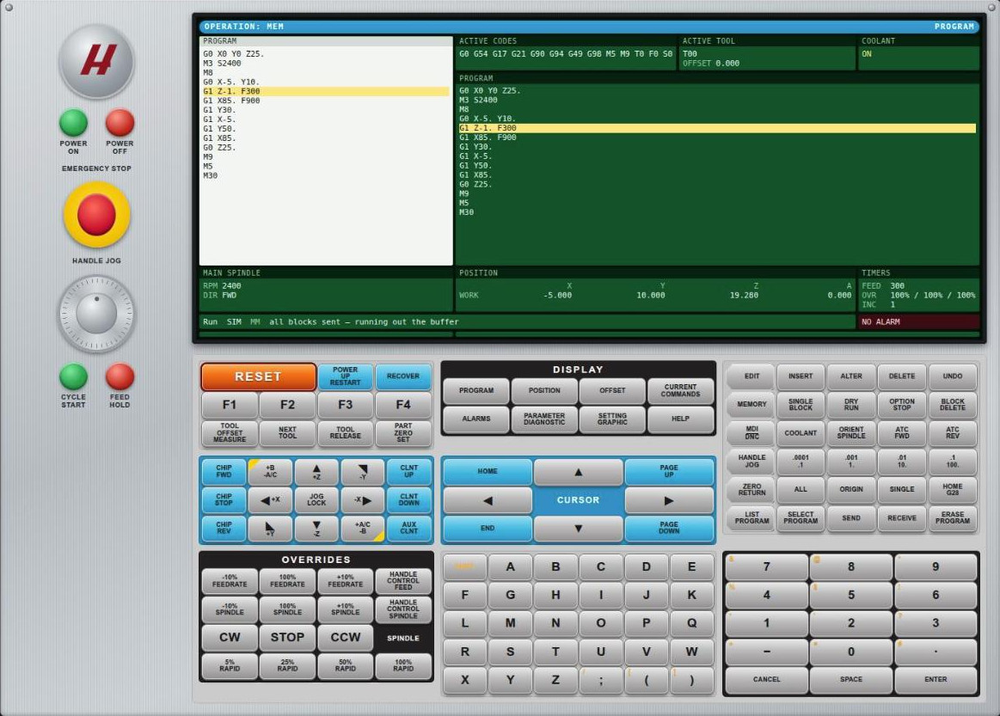

# haasSender

A g-code sender whose entire operator interface is a replica of a HAAS mill
pendant, so students learning on HAAS machines can practise the real workflow —
modes, display panes, HANDLE JOG, CYCLE START, offsets, on-control editing —
against a grblHAL machine, a USB GRBL board, or nothing at all.



*Mid-cut in `OPERATION: MEM` — spindle at 2400 FWD, coolant on, and the block
under the tool highlighted in both the program pane and the main display. No
hardware attached; that is the built-in simulator.*

Target hardware is the companion [grblhal-clearcore](../grblhal-clearcore) project
(Teknic ClearCore, 4-axis XYZA). Reference for the control's layout is the 2014
Mill Operator's Manual in `reference/`; the pendant photos are in `images/`.

Status: **complete.** A student imports a program, picks
it from control memory with LIST PROGRAM, sets work offsets and tool lengths on
the OFFSET pages, edits blocks word by word in EDIT, types blocks in MDI, and runs
the job with the run switches, overrides and cycle timers live. All thirteen
display pages are real. 116 of the 132 keys work; 10 are faded because this
control can never honour them; 6 are muted because they are not built yet — and
pressing any of those 16 says which it is.

**All three transports are verified against hardware.** Web Serial was the last
one, closed 2026-08-07: a 535-block program streamed over USB for two minutes
without an error, the DRO tracked jogs to the increment, and the port survived a
disconnect/reconnect cycle. The native port picker is answered **once per
browser** — after that `getPorts()` reconnects with no dialog at all.

## Run it

```
npm install
npm test          # 50 tests, no hardware needed
npm run dev       # http://localhost:8000
npm run build     # dist/index.html.gz for the board's SD card
```

`npm run dev` serves on localhost, which is a secure context — so Web Serial works
in development without HTTPS. It uses esbuild's server rather than a plain static
one because that one sends no cache validators, so an ordinary reload picks up an
edited module instead of quietly serving the cached copy.

### Pointing it at a machine

The board address is never hardcoded — a fixed IP goes stale on the next DHCP
lease. It is resolved in this order:

1. `?board=<addr>` in the URL — `http://localhost:8000/?board=192.168.0.113`.
   Bookmark one per machine in a classroom.
2. The host that served the page, when installed on a board's SD card.
3. The last address that connected successfully, remembered in `localStorage`.

So local development against a bench board means passing `?board=` once; after
that the plain URL remembers it.

The control starts **off** — an unlit screen, every key dead but POWER ON — which
is a different state from a powered control whose link has dropped. That one shows
`LINK DOWN` and blanks its readings. Both are different again from a control that
is answering.

**POWER ON opens the only dialog in the app** — transport, machine address and
file import. Nothing else sits outside the pendant, because a real HAAS has no
"which machine am I talking to" control and no file picker. POWER OFF drops the
link, and the staleness watchdog blanks the readouts as it would for any other
lost connection.

## Transports

| | Notes |
|---|---|
| **Simulator** | A virtual grblHAL in the tab. No hardware. This is the classroom mode. |
| **WebSocket** | `ws://<board>:81/`, **subprotocol `webui-v3`** |
| **Web Serial** | 115200 8N1. Chrome/Edge, secure context only. ClearCore is `2890:8022`. Picker once, then silent reconnects. |

**The `webui-v3` subprotocol is not optional.** Verified against the board: a
socket opened with no subprotocol, or with `arduino`, completes the handshake and
then passes nothing in either direction, with no diagnostic. With `webui-v3` it is
fully bidirectional. This is worth knowing if you point ioSender or gSender at a
grblHAL websocket and it appears to connect but sits mute.

## Protocol facts measured on the board

Not assumed — read off a live ClearCore running grblHAL 1.1f:

```
[OPT:VNML,100,1024,4,0]   planner 100 blocks, RX buffer 1024 bytes (not the classic 128)
[AXS:4:XYZA]              four axes
<Idle|MPos:…|Bf:100,1023|Ln:187756|FS:0,0|Ov:100,100,100>
$#  → nine coordinate systems, G54…G59.3, plus a per-axis TLO
$13 → 0                   millimetres
```

Consequences the code depends on: the streamer sizes its RX buffer from `[OPT:]`
rather than trusting a constant; `Ln:` is present so the running block comes free;
`G59.1`–`G59.3` can back HAAS `G154 P1`–`P3`; and every HTTP response carries
`Access-Control-Allow-Origin: *`, so a dev server can talk to the board directly.

## Layout

| Path | What |
|---|---|
| `src/grbl.js` | Status/feedback parsing, error and alarm tables, the job streamer |
| `src/transport.js` | WebSocket / Web Serial / simulator behind one interface |
| `src/sim.js` | Virtual grblHAL — no hardware needed |
| `src/keys.js` | The eight key groups, transcribed from figure F2.26 |
| `src/ui/pendant.js` | Panel, left-hand controls and keyboard |
| `src/ui/screen.js` | The thirteen display panes from figure F2.27 |
| `src/haas.css` | Palette sampled from the manual artwork |
| `src/main.js` | State, key dispatch and the render loop |
| `build.js` | esbuild → inline → gzip, with a size budget check |
| `reference/` | Where the HAAS manual goes — see [reference/README.md](reference/README.md) |
| `history/` | Session transcript and design plan |

Full design, the HAAS→grblHAL mapping table and the phase plan are in
[`history/plan.md`](history/plan.md), alongside the full transcript of the session
that produced this project.

## Installing on the board

The board serves `/www/index.html.gz` from its SD card — the slot ESP3D-WebUI
occupies out of the box. **Back that file up first**; it is the fallback if
haasSender misbehaves on the bench.

```sh
npm run build

# back up what is there — the board serves the gzip verbatim, so ask for it
curl -o www-backup.html.gz -H 'Accept-Encoding: gzip' http://<board>/

# create the directory once, if it is a fresh card
curl 'http://<board>/sdfiles?action=createdir&filename=www&path=/'

# upload
SIZE=$(stat -c%s dist/index.html.gz)
curl -F "path=/www" \
     -F "/www/index.html.gzS=$SIZE" \
     -F "myfile=@dist/index.html.gz;filename=/www/index.html.gz" \
     http://<board>/sdfiles
```

Two details the terse version leaves out: the file part carries the **full
destination path as its filename**, not just a name, and ESP3D wants a companion
field named `<path>S` holding the **byte count**. That is the form verified to
work — dropping either was not tested, so treat them as required. The response is
the new directory listing; check the size in it matches what you sent. Then load
`http://<board>/` — served from the board it is same-origin, so it connects
straight back to the machine it came from, with no `?board=` needed.

## Licence

MIT. haasSender links no grblHAL code — it only speaks the wire protocol.

## On the look

The pendant is meant to match the machine, not merely evoke it. The key layout,
legends and grouping come from figure F2.26 of the manual; the pane geometry from
figure F2.27; and the palette is *sampled* from that artwork rather than guessed —
`#cccbcb` bezel, `#231f20` sub-panels, `#0090c2` cyan, the RESET orange ramp and
the `#ffd200` accent. Re-render the source art at any size with:

```
pdftoppm -f 55 -l 55 -r 600 -png reference/english---mill-*.pdf keypad
```

Two deliberate departures. The roundel badge is **not** the HAAS mark — a lookalike
trainer that carries a real manufacturer's logo raises a trademark question that is
the project owner's to answer, so the placeholder stays until someone decides. And
the EMERGENCY STOP button sends a soft reset (`0x18`) and stops the stream; it is
not a hardware E-stop and the control says so when pressed.
